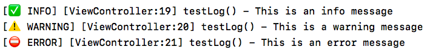

# RSLog
Lightweight thread-safe logging framework implemented in Swift.

### Features
- Emoji and text log levels for visual perception
- Filename and line number logging
- Function name logging
- Three log levels: Info, Warning, Error
- Works only for debug builds

### Example output


### Usage
```swift
// Shortcut for the log singleton
let log = RSLog.shared

log.info("This is an info message")
log.warning("This is a warning message")
log.error("This is an error message")
```
